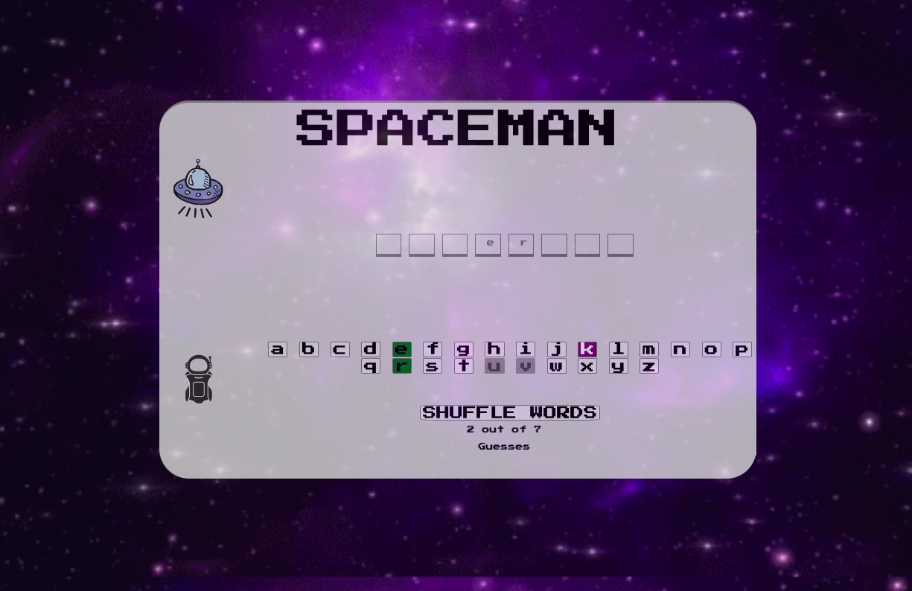

# SPACEMAN GAME

The "Spaceman" game is a word-guessing game, where the player tries to figure out a secret word within a certain number of attempts. Here's how the game works:

The game has generated a secret word for you to guess. You have a limited amount of guesses, in this particular game you will have seven available guesses.

The player begins making a guess by clicking the letter on the keyboard.
Correctly guessed letters will be revealed in their correct positions in the secret word, while incorrect guesses are marked as incorrect and the buttons on the keyboard are disabled.
If the player correctly guesses all the letters in the secret word within the limited number of attempts, they win. Otherwise, they lose and they get to play again.

The player can try various strategies to deduce the secret word, such as identifying patterns or making educated guesses based on the context of the game (hint: the context of the game are things in space!).

Good luck and enjoy the game!

# Screenshots

# Technologies Used

- JavaScript
- HTML
- CSS

# Getting Started

[Click to Play the Spaceman Game!](https://aydagonzalez.github.io/Spaceman-Game/)

# Next Steps

- Future enhancement 1 is to make the keyboard of correctly answered letters be disabled.
- Future enhancement 2 is to make a start menu explaining the game and telling the user the theme of the words.

